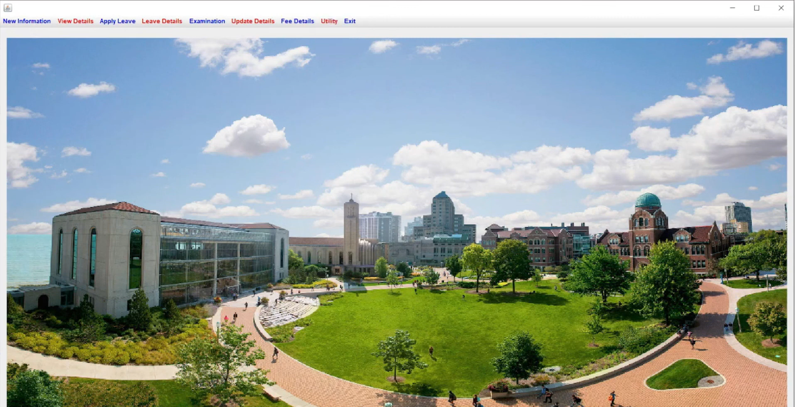
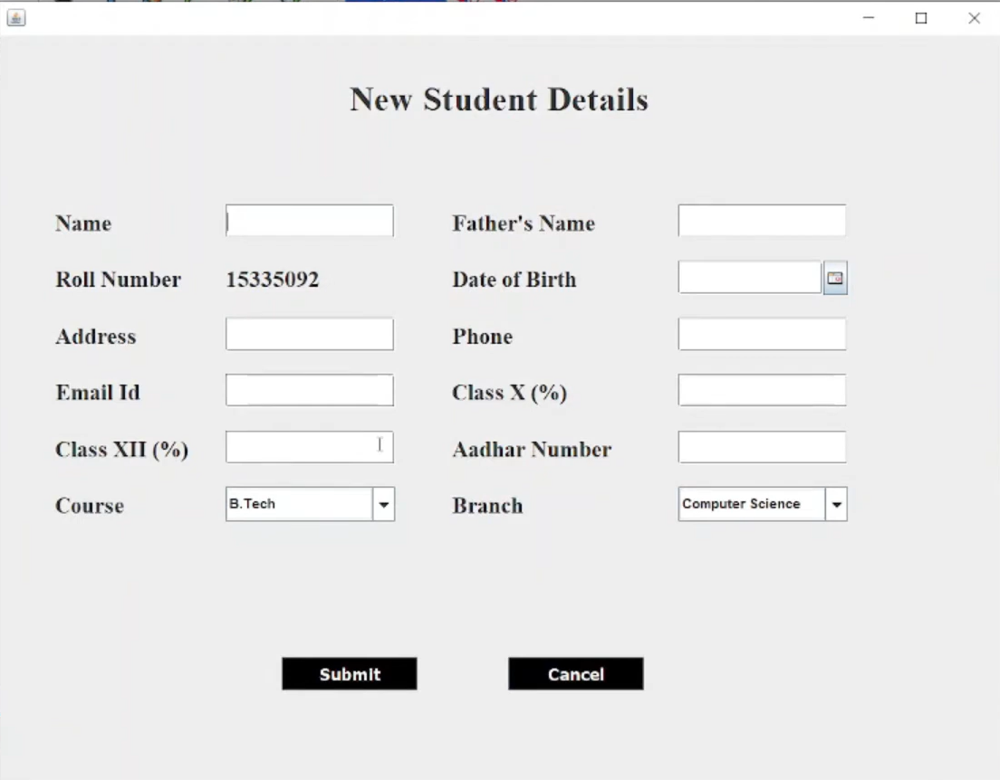

# University-Management-System---Java

A complete *University / College Management System* built using *Java, Swing (GUI), and MySQL database*.  
The system helps in managing student and teacher records, marks, attendance and other administrative activities of a university.

---

## Features
- Add / Update / View / Delete Students
- Add / Update / View / Delete Teachers
- Manage Courses & Subjects
- Enter & View Exam Marks
- Student Attendance Panel
- Secure Login Page (Admin Authentication)
- Search Module for records

---

## Tech Stack
| Component            | Technology         |
|----------------------|--------------------|
| Programming Language | Java               |
| GUI Framework        | Java Swing         |
| Database             | MySQL              |
| IDE (Development)    | NetBeans / VS Code |
| Build Automation     | Ant                |

---

## Project Structure
src/            → Main source code  
Database/       → Database SQL file  
Icons/          → Icons used in GUI  
Build/          → Generated build files  
lib/ (optional) → External JAR dependencies

---

## How to Run the Project
1. Download or clone the repository
2. Open in *NetBeans* / *VS Code with Java Extensions*
3. Import external JAR files (if IDE does not auto-detect)
4. Import the SQL file located at /Database/database.sql into *MySQL*
5. Run Main.java

---
## 📸 Screenshots / Demo

| Login Page | Dashboard |
|------------|-----------|
|  |  |

| Add New Student | New Teacher Detail – 1 |
|-----------------|------------------------|
|  |  |

| New Teacher Detail – 2 | Student Fee |
|------------------------|-------------|
|  |  |
---
## Contribution
Feel free to fork this repository and submit pull requests.

---

## Developed by
Drishti Vashishtha
